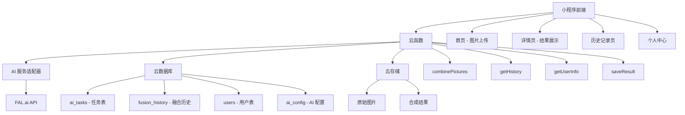
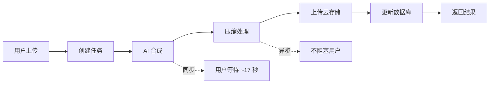
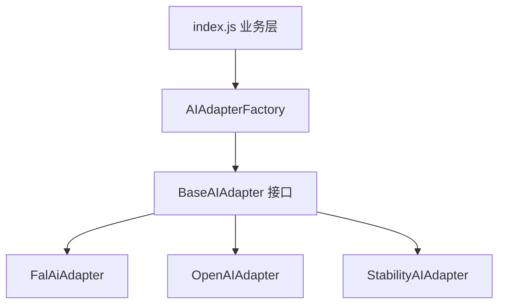
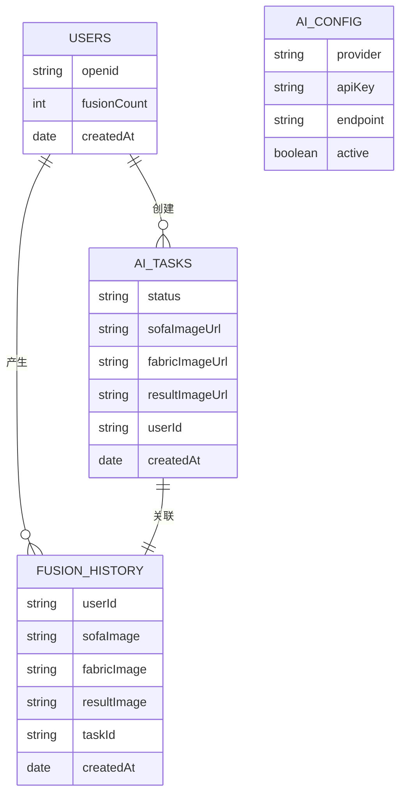
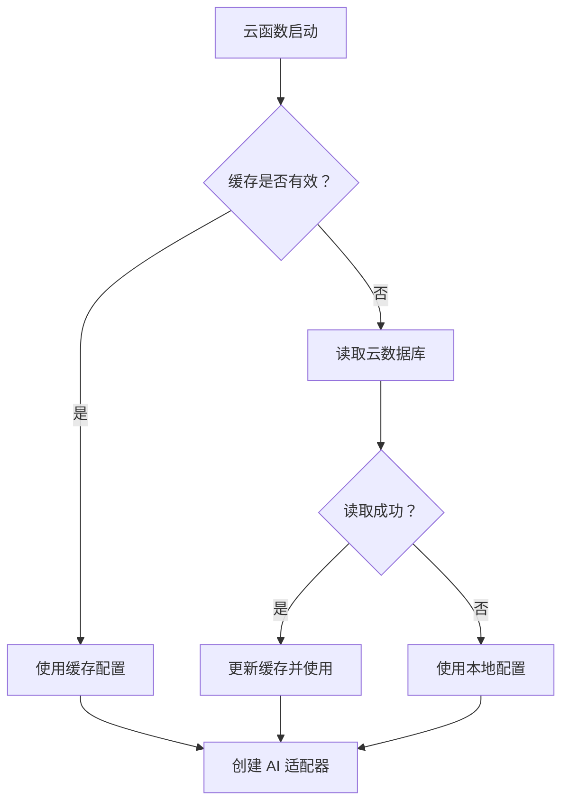

# SkinSwap 项目 Wiki

## 📋 项目概述

**SkinSwap** 是一款基于 AI 技术的沙发布料替换小程序，使用微信小程序云开发架构，集成了 FAL.ai 的 AI 图像编辑能力，实现沙发图片与布料图片的智能融合。

### 核心功能
- 🖼️ **图片合成服务**：上传沙发图片和布料图片，AI 自动合成布料替换效果
- 📜 **历史记录管理**：保存用户的合成历史记录，支持查看和回溯
- 👤 **用户信息管理**：记录用户合成次数等信息
-  **结果持久化**：合成结果自动保存到云存储，支持压缩优化

---

## 🏗️ 系统架构

### 技术架构图



### 技术栈

| 层级 | 技术 | 说明 |
|------|------|------|
| **前端** | 微信小程序 | 原生小程序框架 |
| **后端** | 微信云开发 | Serverless 架构 |
| **AI 服务** | FAL.ai | Flux 2 图像编辑模型 |
| **数据库** | 云数据库 | JSON 文档型数据库 |
| **存储** | 云存储 | 文件上传下载 |
| **设计模式** | 适配器模式 + 工厂模式 | 支持多 AI 服务商 |

---

## 📁 项目结构

```
sofa_skin_swap/
├── miniprogram/              # 小程序前端
│   ├── pages/               # 页面
│   │   ├── index/          # 首页（图片上传）
│   │   ├── detail/         # 详情页（结果展示）
│   │   ├── history/        # 历史记录页
│   │   ── profile/        # 个人中心
│   ├── components/          # 组件
│   │   ├── tab-bar/        # 底部导航栏
│   │   └── upload-box/     # 图片上传组件
│   ├── utils/              # 工具函数
│   └── app.js              # 小程序入口
│
├── cloudfunctions/          # 云函数
│   ├── combinePictures/    # 图片合成（核心）
│   │   ├── adapters/       # AI 适配器
│   │   │   ├── BaseAIAdapter.js      # 抽象基类
│   │   │   ├── FalAiAdapter.js       # FAL.ai 实现
│   │   │   └── AIAdapterFactory.js   # 工厂类
│   │   ├── config/         # 配置管理
│   │   │   ├── ConfigManager.js      # 配置管理器
│   │   │   └── aiConfig.js           # AI 配置
│   │   ── index.js        # 主函数
│   ├── getHistory/         # 获取历史记录
│   ├── getUserInfo/        # 获取用户信息
│   └── saveResult/         # 保存结果
│
├── docs/                    # 文档
└── .env                     # 环境变量配置
```

---

## 🔧 核心模块详解

### 1. 图片合成服务 (combinePictures)

#### 业务流程



#### 核心代码流程

```javascript
// 1. 创建任务记录
const task = await db.collection('ai_tasks').add({...})

// 2. 同步执行 AI 合成（用户等待部分）
const result = await processAICombine(taskId, sofaUrl, fabricUrl, userId)

// 3. 异步后处理（不阻塞用户）
processPostAI(taskId, result.imageUrl, ...)
  .catch(err => console.error('异步后处理失败:', err))

// 4. 返回结果给用户
return { success: true, taskId, resultImageUrl: result.imageUrl }
```

#### 关键技术点

- **同步 + 异步结合**：AI 合成同步执行保证用户体验，后处理异步提升性能
- **临时下载链接**：使用 `cloud.getTempFileURL()` 获取云文件临时链接供 AI 服务使用
- **图片压缩**：使用 Jimp 库压缩图片（640px 宽度，65% 质量）
- **数据库事务**：使用 `Promise.all()` 并行更新多个集合

---

### 2. AI 服务适配器模式

#### 架构设计



#### 核心接口

```javascript
// BaseAIAdapter.js - 抽象基类
class BaseAIAdapter {
  combineImages(sofaImageUrl, fabricImageUrl) { /* 必须实现 */ }
  getName() { /* 获取适配器名称 */ }
  validateConfig() { /* 验证配置 */ }
}
```

#### 切换 AI 服务商

只需修改 `config/aiConfig.js`：

```javascript
// 从 FAL.ai 切换到 OpenAI
const CURRENT_PROVIDER = 'OPENAI'  // 原来是 'FAL_AI'
```

#### 添加新 AI 服务商

1. 创建适配器类：`adapters/OpenAIAdapter.js`
2. 添加配置：`config/aiConfig.js`
3. 注册工厂：`AIAdapterFactory.js`
4. 切换配置即可使用

---

### 3. 云数据库设计

#### 数据库集合

| 集合名称 | 用途 | 主要字段 |
|---------|------|---------|
| `ai_tasks` | AI 任务记录 | `status`, `sofaImageUrl`, `fabricImageUrl`, `resultImageUrl`, `userId` |
| `fusion_history` | 融合历史 | `userId`, `sofaImage`, `fabricImage`, `resultImage`, `taskId` |
| `users` | 用户信息 | `openid`, `fusionCount`, `createdAt` |
| `ai_config` | AI 服务配置 | `provider`, `apiKey`, `endpoint`, `active` |

#### 数据库 ER 图



---

### 4. 配置管理系统

#### 双层配置设计

```
┌─────────────────────────────────┐
│   云数据库配置 (ai_config)       │
│   - 动态更新，无需部署            │
│   - 5 分钟缓存                   │
│   - API Key 安全管理             │
└─────────────────────────────────┘
              ↓
┌─────────────────────────────────┐
│   本地配置 (aiConfig.js)         │
│   - 后备方案                    │
│   - 开发调试方便                │
└─────────────────────────────────┘
```

#### 配置读取流程



---

## 🚀 部署指南

### 环境准备

1. **微信开发者工具**：2.2.3+ 版本
2. **Node.js**：14.x+ 版本
3. **小程序 AppID**：`wxf50d673f312c001c`
4. **云环境 ID**：`cloud1-0g6q8c7v1cdda39b`

### 部署步骤

#### 1. 克隆项目
```bash
git clone <repository_url>
cd sofa_skin_swap
```

#### 2. 安装依赖
```bash
# 云函数依赖
cd cloudfunctions/combinePictures
npm install
```

#### 3. 配置环境变量
编辑 `.env` 文件：
```env
FAL_API_KEY=your_fal_api_key_here
```

#### 4. 创建云数据库集合

在云开发控制台创建以下集合：
- `ai_tasks`
- `fusion_history`
- `users`
- `ai_config`

#### 5. 配置 AI 服务

在 `ai_config` 集合中添加记录：
```json
{
  "provider": "FAL_AI",
  "name": "FAL.ai",
  "apiKey": "your_api_key",
  "endpoint": "fal-ai/flux-2/edit",
  "active": true
}
```

#### 6. 上传云函数

方式一：使用微信开发者工具
- 右键点击 `cloudfunctions` 目录
- 选择「上传并部署：云端安装依赖」

方式二：使用脚本
```bash
chmod +x uploadCloudFunction.sh
./uploadCloudFunction.sh
```

---

## 🔐 安全与权限

### API Key 安全管理

- ✅ **数据库存储**：API Key 存储在云数据库，不提交到代码仓库
- ✅ **权限控制**：`ai_config` 集合设置为「仅管理端可读写」
- ✅ **环境变量**：本地开发使用 `.env` 文件
- ✅ **定期轮换**：建议定期更换 API Key

### 数据库权限设置

| 集合 | 小程序端 | 管理端 |
|------|---------|--------|
| `ai_tasks` | 仅可读自己的数据 | 可读写 |
| `fusion_history` | 仅可读自己的数据 | 可读写 |
| `users` | 仅可读自己的数据 | 可读写 |
| `ai_config` | 不可读 | 可读写 |

---

## 📊 性能优化

### 1. 同步 + 异步处理

```javascript
// 用户等待部分（同步）~17 秒
const result = await processAICombine(...)

// 用户不等待部分（异步）
processPostAI(...).catch(err => console.error(err))
```

### 2. 配置缓存

- 缓存时长：5 分钟
- 减少数据库查询次数
- 支持手动清除缓存

### 3. 图片压缩

- 宽度压缩至 640px
- JPEG 质量 65%
- 减少存储空间和加载时间

### 4. 并行数据库操作

```javascript
await Promise.all([
  db.collection('ai_tasks').doc(taskId).update(...),
  db.collection('fusion_history').add(...),
  updateUserFusionCount(userId)
])
```

---

## 🧪 测试指南

### 单元测试

测试 AI 适配器：
```javascript
const adapter = AIAdapterFactory.createAdapter()
const result = await adapter.combineImages(sofaUrl, fabricUrl)
console.assert(result.imageUrl, '应返回图片 URL')
```

### 集成测试

1. 上传测试图片到云存储
2. 调用 `combinePictures` 云函数
3. 验证返回结果
4. 检查数据库记录
5. 验证云存储文件

### 性能测试

- AI 合成耗时：~17 秒
- 后处理耗时：~3 秒
- 数据库查询：<100ms

---

## 🔧 故障排查

### 常见问题

#### 1. "未找到有效的 AI 配置"

**原因**：
- `ai_config` 集合不存在
- 没有 `active: true` 的记录
- 数据库权限设置错误

**解决方案**：
1. 检查集合是否存在
2. 添加有效配置记录
3. 检查权限设置

#### 2. "API Key 无效"

**原因**：
- API Key 格式错误
- API Key 已过期
- 包含多余空格

**解决方案**：
1. 重新复制 API Key（注意不要有空格）
2. 在 FAL.ai 控制台验证
3. 检查数据库字段值

#### 3. 图片合成超时

**原因**：
- 网络问题
- AI 服务响应慢
- 图片过大

**解决方案**：
1. 压缩上传的图片
2. 增加超时设置
3. 检查网络连接

#### 4. 配置更新不生效

**原因**：配置被缓存

**解决方案**：
1. 等待 5 分钟缓存过期
2. 重新部署云函数
3. 调用 `clearConfigCache()`

---

## 📈 监控与日志

### 云函数日志

关键日志点：
```javascript
console.log(`任务 ${taskId}: 开始 AI 合成`)
console.log(`任务 ${taskId}: AI 合成完成`)
console.log(`任务 ${taskId}: 开始后处理...`)
console.log(`任务 ${taskId}: 后处理完成，耗时 ${...}秒`)
```

### 性能监控

监控指标：
- AI 合成成功率
- 平均响应时间
- 异步后处理失败率
- 数据库查询次数

---

## 🔄 扩展与升级

### 支持更多 AI 服务商

已实现：
- ✅ FAL.ai (Flux 2)

可扩展：
- 🔲 OpenAI (DALL-E 3)
- 🔲 Stability AI
- 🔲 Midjourney

### 功能扩展

- [ ] 批量处理
- [ ] 高级编辑选项
- [ ] 实时预览
- [ ] 分享功能
- [ ] 付费积分系统

---

## 📚 参考资料

### 官方文档
- [微信云开发文档](https://developers.weixin.qq.com/miniprogram/dev/wxcloud/basis/getting-started.html)
- [FAL.ai API 文档](https://fal.ai/docs)
- [Jimp 图像处理](https://github.com/oliver-moran/jimp)

### 设计模式
- 适配器模式（Adapter Pattern）
- 工厂模式（Factory Pattern）
- 开闭原则（Open-Closed Principle）

---

##  贡献指南

### 开发流程

1. Fork 项目
2. 创建特性分支 (`git checkout -b feature/AmazingFeature`)
3. 提交更改 (`git commit -m 'Add some AmazingFeature'`)
4. 推送到分支 (`git push origin feature/AmazingFeature`)
5. 创建 Pull Request

### 代码规范

- 使用 ES6+ 语法
- 异步函数使用 `async/await`
- 错误处理使用 `try-catch`
- 注释使用中文

---

##  更新日志

### v1.0.0 (2024-03)
- ✅ 初始版本发布
- ✅ 图片合成功能
- ✅ 历史记录管理
- ✅ 用户信息统计
- ✅ AI 适配器架构

---

## 📧 联系方式

- 项目仓库：[GitHub](your_repo_url)
- 问题反馈：[Issues](your_issues_url)

---

## 📄 许可证

本项目采用 MIT 许可证

---

**最后更新**: 2026-04-03
